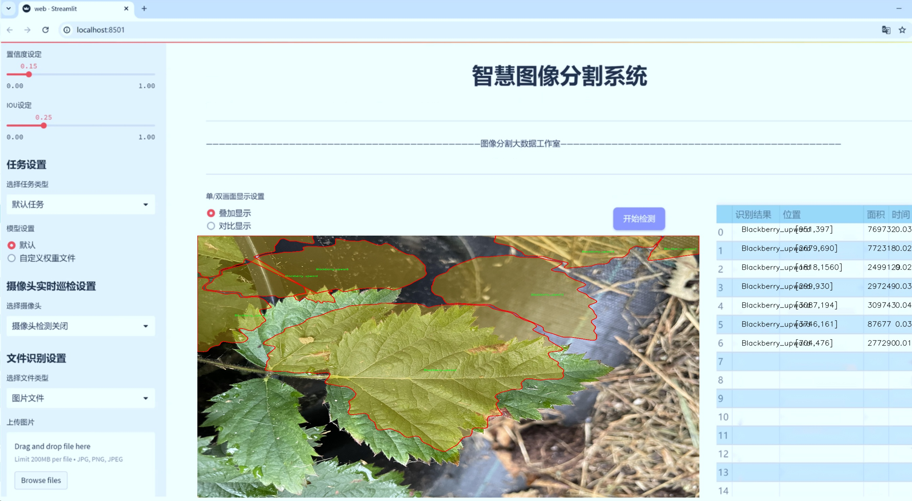
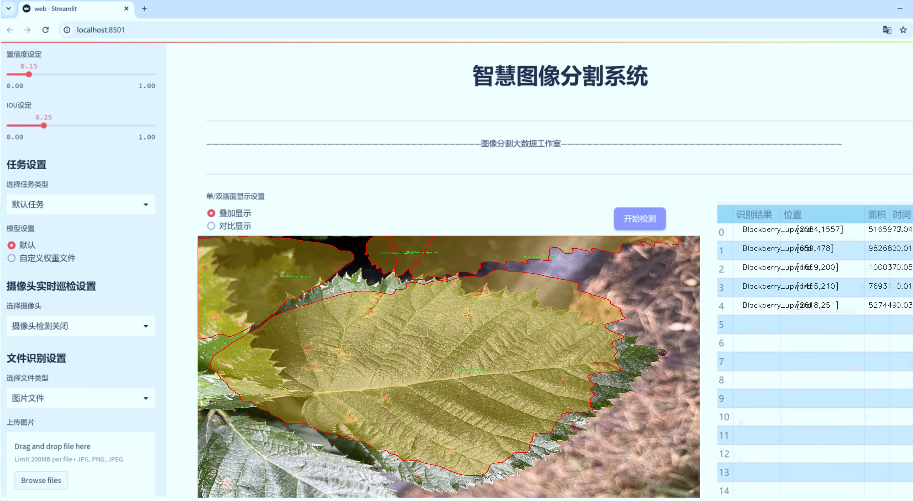
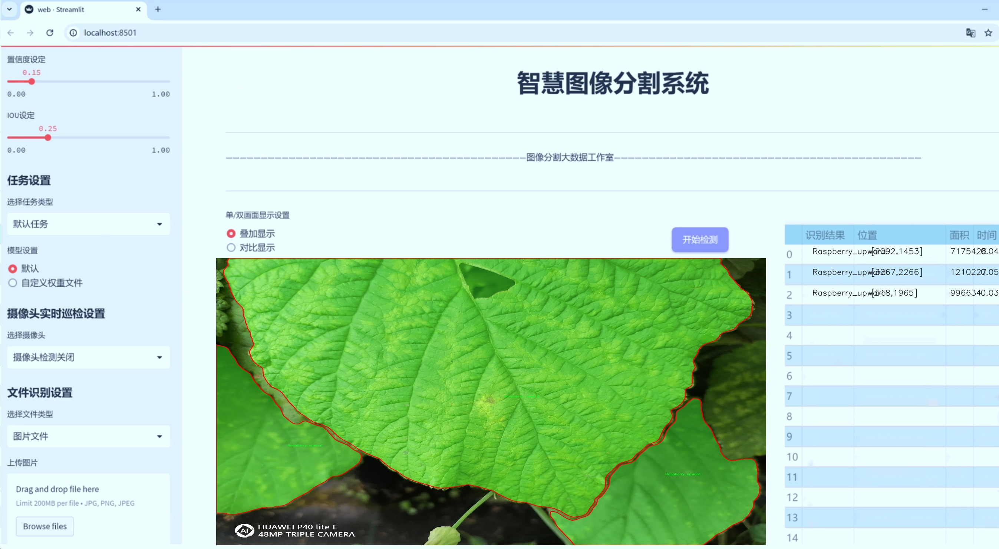
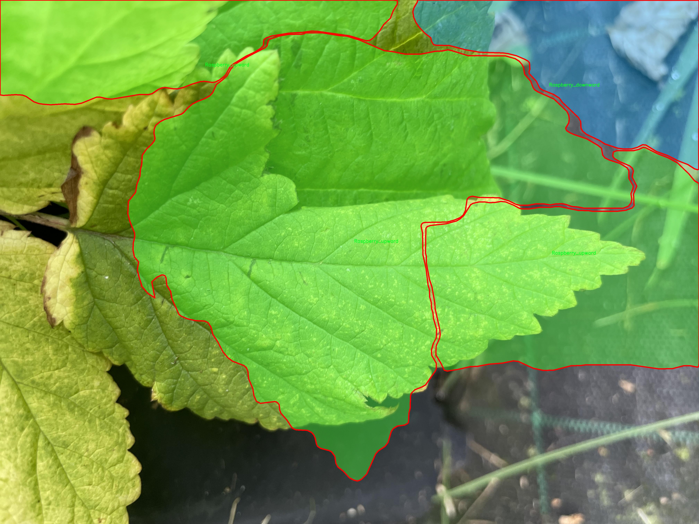
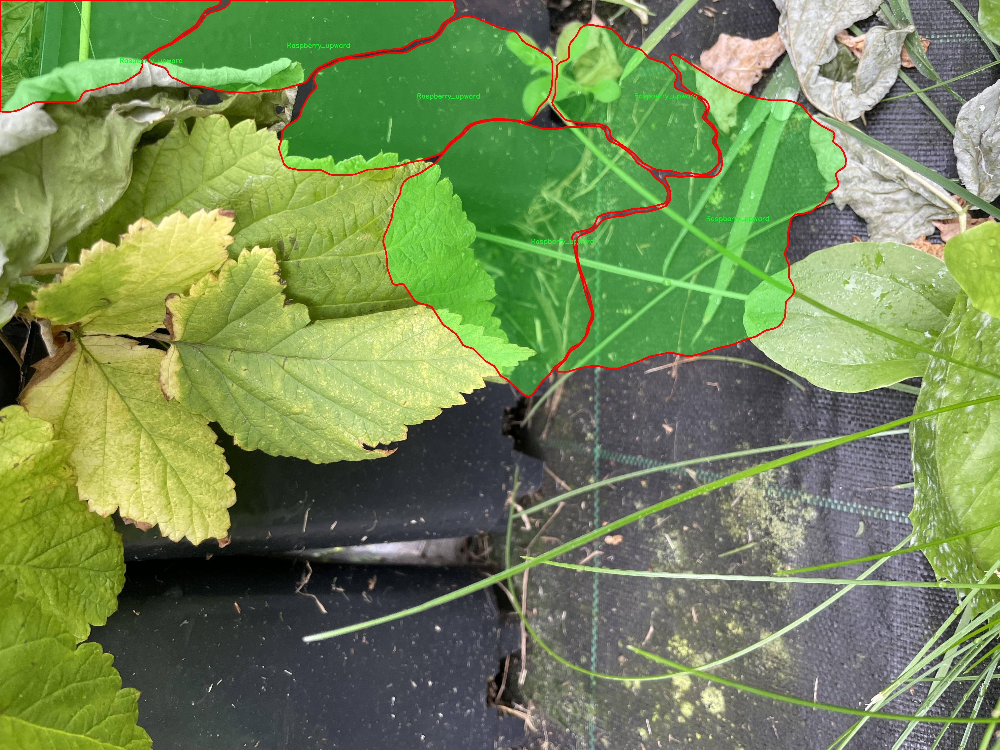
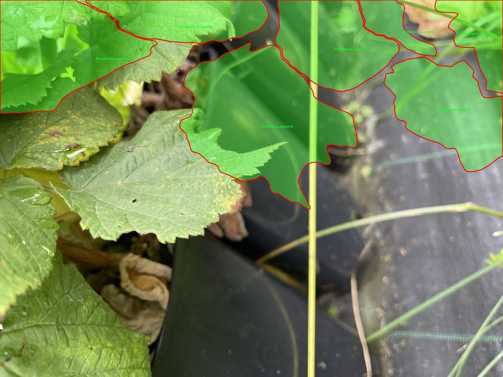
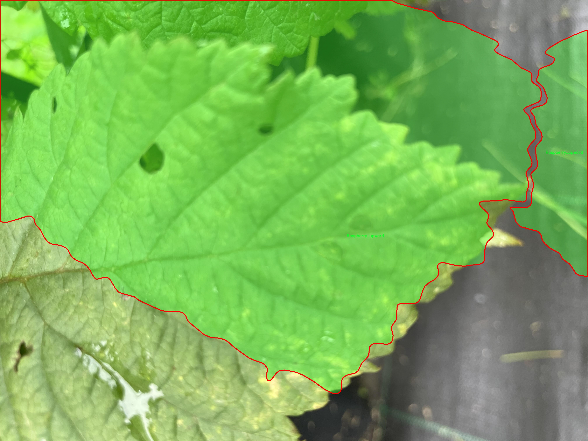
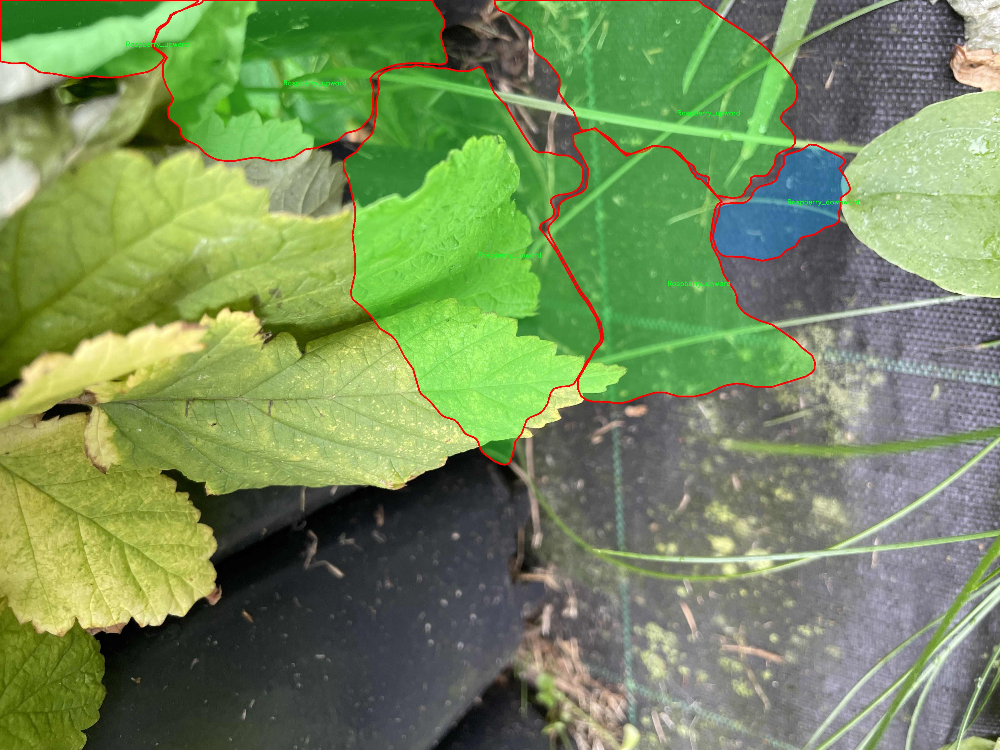
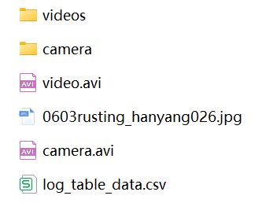

# 水果叶片分割系统： yolov8-seg-dyhead

### 1.研究背景与意义

[参考博客](https://gitee.com/YOLOv8_YOLOv11_Segmentation_Studio/projects)

[博客来源](https://kdocs.cn/l/cszuIiCKVNis)

研究背景与意义

随着农业科技的不断发展，精准农业的理念逐渐深入人心，尤其是在作物病虫害监测与管理方面，计算机视觉技术的应用展现出了巨大的潜力。水果叶片的健康状况直接影响到作物的产量和品质，因此，如何快速、准确地对水果叶片进行分割与识别，成为了农业研究中的一个重要课题。近年来，深度学习技术的飞速发展为图像分割任务提供了新的解决方案，其中YOLO（You Only Look Once）系列模型因其高效的实时处理能力而备受关注。YOLOv8作为该系列的最新版本，具备了更强的特征提取能力和更高的分割精度，为水果叶片的实例分割提供了良好的基础。

本研究旨在基于改进的YOLOv8模型，构建一个高效的水果叶片分割系统，以实现对黑莓和树莓等水果叶片的精确识别与分割。数据集包含1200张图像，涵盖了四个类别：向下生长的黑莓叶片、向上生长的黑莓叶片、向下生长的树莓叶片以及向上生长的树莓叶片。这些类别的选择不仅体现了不同生长状态的叶片特征，也为模型的训练提供了丰富的样本。通过对这些图像的深入分析，我们可以提取出不同叶片在形态、颜色和纹理等方面的特征，从而提高模型的分割精度。

水果叶片的分割不仅是对图像处理技术的挑战，更是对农业生产实践的直接影响。准确的叶片分割可以为后续的病虫害检测、营养状态评估以及生长监测提供可靠的数据支持。通过本研究开发的分割系统，农业工作者能够实时获取叶片的健康信息，及时采取措施应对潜在的病虫害威胁，从而实现精准施药和科学管理，提高农业生产效率和可持续发展水平。

此外，改进YOLOv8模型的研究也具有重要的学术意义。通过对模型架构的优化与调整，我们不仅可以提升其在水果叶片分割任务中的表现，还能够为其他领域的实例分割问题提供借鉴。这种跨领域的应用潜力，使得本研究不仅限于水果叶片的分割，更为深度学习技术在农业领域的推广与应用提供了新的思路。

综上所述，基于改进YOLOv8的水果叶片分割系统的研究，不仅具有重要的实践意义，还在理论层面上推动了计算机视觉技术在农业领域的应用发展。通过对水果叶片的精准分割，我们期望能够为现代农业的智能化、信息化进程贡献一份力量，助力实现更高效、更可持续的农业生产模式。

### 2.图片演示







注意：本项目提供完整的训练源码数据集和训练教程,由于此博客编辑较早,暂不提供权重文件（best.pt）,需要按照6.训练教程进行训练后实现上图效果。

### 3.视频演示

[3.1 视频演示](https://www.bilibili.com/video/BV1dtUZYSEnw/)

### 4.数据集信息

##### 4.1 数据集类别数＆类别名

nc: 4
names: ['Blackberry_downward', 'Blackberry_upward', 'Raspberry_downward', 'Raspberry_upward']


##### 4.2 数据集信息简介

数据集信息展示

在本研究中，我们采用了名为“sport”的数据集，以训练和改进YOLOv8-seg模型，旨在实现高效的水果叶片分割系统。该数据集专注于特定类型的水果叶片，涵盖了四个主要类别，分别是“Blackberry_downward”、“Blackberry_upward”、“Raspberry_downward”和“Raspberry_upward”。这些类别的选择不仅反映了水果植物的多样性，还为模型提供了丰富的特征和变异性，从而增强了分割系统的泛化能力。

“sport”数据集的构建过程注重数据的多样性和代表性。每个类别的样本均经过精心挑选，确保涵盖不同生长阶段、光照条件和背景环境下的叶片图像。这种多样性使得模型在训练过程中能够学习到更为全面的特征，从而提高其在实际应用中的表现。例如，黑莓叶片在不同生长方向（向下和向上）下的外观差异，以及覆盆子叶片在不同环境光照条件下的变化，均为模型提供了丰富的训练数据。这些因素共同作用，使得模型能够更好地适应复杂的自然环境，提高其在真实场景中的应用效果。

在数据集的标注过程中，我们采用了高精度的标注工具，确保每个图像中的叶片区域被准确地标记出来。标注的准确性对于训练深度学习模型至关重要，因为它直接影响到模型的学习效果和最终的分割精度。为此，我们的标注团队经过专业培训，严格遵循标注规范，确保每个类别的标注一致性和准确性。此外，为了进一步提升数据集的质量，我们还进行了多轮的审核和校正，确保每个样本的标注都经过严格的验证。

在数据集的使用过程中，我们还考虑到了数据增强技术的应用，以进一步提升模型的鲁棒性。通过对原始图像进行旋转、缩放、翻转和颜色调整等操作，我们能够生成更多的训练样本，从而有效地扩展数据集的规模。这种方法不仅能够缓解过拟合问题，还能提高模型在不同条件下的适应能力，使其在面对未见过的样本时仍能保持良好的分割性能。

总的来说，“sport”数据集为改进YOLOv8-seg的水果叶片分割系统提供了坚实的基础。通过精心挑选的类别、严格的标注过程以及有效的数据增强策略，我们相信该数据集将为研究人员和开发者提供强有力的支持，推动水果叶片分割技术的进一步发展。未来，我们期待该系统能够在农业监测、病虫害防治等领域发挥重要作用，为现代农业的智能化发展贡献力量。











### 5.项目依赖环境部署教程（零基础手把手教学）

[5.1 环境部署教程链接（零基础手把手教学）](https://www.bilibili.com/video/BV1jG4Ve4E9t/?vd_source=bc9aec86d164b67a7004b996143742dc)


[5.2 安装Python虚拟环境创建和依赖库安装视频教程链接（零基础手把手教学）](https://www.bilibili.com/video/BV1nA4VeYEze/?vd_source=bc9aec86d164b67a7004b996143742dc)

### 6.手把手YOLOV8-seg训练视频教程（零基础手把手教学）

[6.1 手把手YOLOV8-seg训练视频教程（零基础小白有手就能学会）](https://www.bilibili.com/video/BV1cA4VeYETe/?vd_source=bc9aec86d164b67a7004b996143742dc)


按照上面的训练视频教程链接加载项目提供的数据集，运行train.py即可开始训练



     Epoch   gpu_mem       box       obj       cls    labels  img_size
     1/200     0G   0.01576   0.01955  0.007536        22      1280: 100%|██████████| 849/849 [14:42<00:00,  1.04s/it]
               Class     Images     Labels          P          R     mAP@.5 mAP@.5:.95: 100%|██████████| 213/213 [01:14<00:00,  2.87it/s]
                 all       3395      17314      0.994      0.957      0.0957      0.0843

     Epoch   gpu_mem       box       obj       cls    labels  img_size
     2/200     0G   0.01578   0.01923  0.007006        22      1280: 100%|██████████| 849/849 [14:44<00:00,  1.04s/it]
               Class     Images     Labels          P          R     mAP@.5 mAP@.5:.95: 100%|██████████| 213/213 [01:12<00:00,  2.95it/s]
                 all       3395      17314      0.996      0.956      0.0957      0.0845

     Epoch   gpu_mem       box       obj       cls    labels  img_size
     3/200     0G   0.01561    0.0191  0.006895        27      1280: 100%|██████████| 849/849 [10:56<00:00,  1.29it/s]
               Class     Images     Labels          P          R     mAP@.5 mAP@.5:.95: 100%|███████   | 187/213 [00:52<00:00,  4.04it/s]
                 all       3395      17314      0.996      0.957      0.0957      0.0845


### 7.50+种全套YOLOV8-seg创新点加载调参实验视频教程（一键加载写好的改进模型的配置文件）

[7.1 50+种全套YOLOV8-seg创新点加载调参实验视频教程（一键加载写好的改进模型的配置文件）](https://www.bilibili.com/video/BV1Hw4VePEXv/?vd_source=bc9aec86d164b67a7004b996143742dc)

### YOLOV8-seg算法简介

原始YOLOv8-seg算法原理

YOLOv8-seg算法是YOLO系列模型的最新版本，旨在通过高效的目标检测和分割技术，为计算机视觉领域带来更高的准确性和速度。该算法由Ultralytics团队在YOLOv5的基础上进行改进，结合了近两年内在目标检测领域的各种成功经验和技术创新，于2023年1月正式发布。YOLOv8-seg不仅继承了YOLO系列的核心思想，还在网络结构、数据处理和训练策略等多个方面进行了重要的优化和创新。

在YOLOv8-seg的设计中，输入端采用了一系列先进的数据增强技术，以提高模型的鲁棒性和泛化能力。尽管Mosaic数据增强在提升模型性能方面表现良好，但YOLOv8-seg在训练的最后10个epoch中停止使用该技术，以避免破坏数据的真实分布。这一策略的实施，旨在确保模型在真实场景中的表现更加可靠。

网络结构方面，YOLOv8-seg的主干网络相较于前代模型进行了重要的改进。具体而言，C3模块被C2f模块所替代。C2f模块在C3模块的基础上，借鉴了YOLOv7中的ELAN结构，增加了更多的跳层连接。这种设计不仅丰富了梯度流的信息，还在一定程度上实现了模型的轻量化，确保了计算效率的提升。同时，SPPF模块依然被保留，确保了特征提取的效果不变，并减少了执行时间。

在颈部网络的设计中，YOLOv8-seg同样将所有的C3模块更改为C2f模块，并删除了两处上采样之前的卷积连接层。这一系列的改动使得特征融合过程更加高效，能够更好地处理不同尺度的特征图，为后续的目标检测和分割任务奠定了坚实的基础。

YOLOv8-seg的头部网络采用了YOLOX中引入的解耦头结构，设计了两条并行的分支，分别用于提取类别和位置特征。这种解耦设计的核心在于，分类任务更关注特征图中提取到的特征与已有类别的相似性，而定位任务则更注重边界框与真实框之间的位置关系。通过这种方式，YOLOv8-seg在收敛速度和预测精度上均得到了显著提升。此外，YOLOv8-seg采用了无锚框结构，直接预测目标的中心位置，并引入了任务对齐学习（Task Alignment Learning，TAL）机制，以区分正负样本。该机制通过分类分数和IOU的高次幂乘积来衡量任务对齐程度，从而在分类和定位损失函数中引入了这一指标，确保模型在定位和分类任务中均能取得良好的效果。

在模型的检测性能方面，YOLOv8-seg在多个标准数据集上表现优异，尤其是在COCO数据集上，其在不同尺寸下的mAP（mean Average Precision）指标均优于前代模型。这一结果不仅证明了YOLOv8-seg在目标检测任务中的有效性，也为其在实际应用中的广泛部署提供了有力支持。

值得注意的是，YOLOv8-seg在处理复杂环境下的小目标检测时，仍然面临一些挑战。例如，在水面环境中，小目标漂浮物的特征复杂且背景多样，导致定位误差和目标感知能力不足等问题。为了解决这些问题，YOLOv8-seg引入了BiFormer双层路由注意力机制，构建了C2fBF模块，以捕获远程依赖，保留特征提取过程中更细粒度的上下文信息。此外，针对小目标漏检问题，YOLOv8-seg还添加了一个更小的检测头，以提升网络对小目标的感知能力，并在Neck端引入GSConv和Slim-neck技术，以保持精度并降低计算量。

总的来说，YOLOv8-seg算法在目标检测和分割领域的创新与改进，使其成为了一个高效、准确且易于部署的模型。其在设计上的多项优化，不仅提升了模型的性能，也为后续的研究和应用提供了广阔的空间。随着YOLOv8-seg的不断发展与完善，预计将在更广泛的实际场景中发挥重要作用，推动计算机视觉技术的进一步进步。


### 9.系统功能展示（检测对象为举例，实际内容以本项目数据集为准）

图9.1.系统支持检测结果表格显示

  图9.2.系统支持置信度和IOU阈值手动调节

  图9.3.系统支持自定义加载权重文件best.pt(需要你通过步骤5中训练获得)

  图9.4.系统支持摄像头实时识别

  图9.5.系统支持图片识别

  图9.6.系统支持视频识别

  图9.7.系统支持识别结果文件自动保存

  图9.8.系统支持Excel导出检测结果数据





### 10.50+种全套YOLOV8-seg创新点原理讲解（非科班也可以轻松写刊发刊，V11版本正在科研待更新）

#### 10.1 由于篇幅限制，每个创新点的具体原理讲解就不一一展开，具体见下列网址中的创新点对应子项目的技术原理博客网址【Blog】：


[10.1 50+种全套YOLOV8-seg创新点原理讲解链接](https://gitee.com/qunmasj/good)

#### 10.2 部分改进模块原理讲解(完整的改进原理见上图和技术博客链接)【如果此小节的图加载失败可以通过CSDN或者Github搜索该博客的标题访问原始博客，原始博客图片显示正常】
### YOLOv8简介
在各种目标检测算法中，YOLO系列因其速度和准确度间的优异平衡脱颖而出，能够准确、快速的识别目标，便于部署到各种移动设备中，已经广泛应用于各种领域的目标检测、跟踪和分割。目前最新版本 YOLOv8由原v5的开发团队Ultralytics于2023年1月提出，按规格大小可划分为n、s、m、1和x5个版本，是目前最先进的目标检测算法，有着优异的性能，很适合用于无人机航拍图像目标检测。其网络结构如图所示。

YOLOv8模型包括Input、Backbone、Neck 和Head4部分。其中 Input选用了Mosaic数据增强方法，并且对于不同大小的模型，有部分超参数会进行修改，典型的如大模型会开启 MixUp 和CopyPaste数据增强，能够丰富数据集，提升模型的泛化能力和鲁棒性。Backbone主要用于提取图片中的信息，提供给Neck和Head使用，由多个Conv、C2f模块和尾部的SPPF组成。Conv模块由单个Conv2d、
BatchNorm2d和激活函数构成,用丁是双行在万E5特征图;YOLOv8参考了C3模块的残左绒以心YOLOv7[16l的ELAN思想，设计出了C2f 结构，可以在保证轻量化的同时获得更加丰富的梯度流信息，并根据模型尺度来调整通道数，大幅提升了模型性能;SPPF是空间金字塔池化，能够融合不同尺度的特征。Neck部分主要起特征融合的作用，充分利用了骨干网络提取的特征，采用FPN[17]+PAN[18〕结构，
能够增强多个尺度上的语义表达和定位能力。Head输出端根据前两部分处理得到的特征来获取检测目标的类别和位置信息，做出识别,换以小旦公来和定解耦头结构,将分类和检测头分:9w‘无锅框的位关注侧重点不同的问题，同时也采用了无锚框的目标检测（Anchor-Free)，能够提升检测速度。Loss计算方面采用了正负样本动态分配策略，使用 VFLLoss 作为分类损失，使用DFLLoss+CIOU Loss作为回归损失。

### AutoFocus: Efficient Multi-Scale Conv简介

参考该博客提出了AutoFocus，一种高效的多尺度目标检测算法。相较于以前对整个图像金字塔进行处理，该方法以一种由表及里的姿态，仅处理哪些整体上看来很有可能存在小物体的区域。这个可以通过预测一张类别未知的分割图FocusPixels来得到。为了高效利用FocusPixels，另外一个算法用于产生包含FocusPixels的FocusChips，这样可以减少计算量并处理更更精细的尺度。在不同尺度上FocusChips所得到的检测结果综合时，会出现问题，我们也提供了解决问题的方案。AutoFocus在COCO上的结果有49.7%mAP（50%重叠下68.3%），与多尺度baseline相仿但是快了2.5倍。金字塔中处理的像素数量减少了5倍mAP只下降1%，在与RetinaNet采用相同的ResNet-101结构且速度相同时，高了10%mAP。

人类寻找物体是一个动态的过程，且寻找时间与场景的复杂度是直接相关的。当我们的眼神在不同的点之间漂移时，其他的区域会被我们有意忽视。然而，现在的检测算法是一种静态的推理过程且图像金字塔中的每个像素都受到了一样的对待，这使得过程变得没有效率。现在许多的应用都不强调实时性，而计算上的节省其实可以产生很大收益。

在COCO数据集中，虽然40%的物体都是小物体，但是它们一共只占了全图的0.3%。如果金字塔是3倍关系，则在高分辨率层要进行9倍的运算。XXX 。那么有没有办法在低分辨率下找出可能含有这些物体的区域呢？

以人眼方案类比，我们可以从低分辨率图像开始，找出有可能存在物体的区域再“聚集”到高分辨率。我们的AutoFocus会在一层中计算小物体的分割图FocusPixels，而在每一个FocusPixels上会用一个算法产生下一层所需要关注的chips。在COCO的最大分辨率层上我们可以只处理**20%的像素而性能不下降，如果只处理5%**也只下降1%而已。


图像金字塔与卷积神经网络对CV十分重要。然而卷积神经网络无法做到对尺度不敏感，所以为了不同大小的物体需要依赖图像金字塔。虽然训练已经有了高效的方法，但是其推断时间依然远离实际使用标准。

目标检测加速有很长历史了。常用的有特征近似以减少尺度、级联、特征金字塔，且最后一个最近很多人研究。

AutoFocus为速度与精度之间提供了一个平滑的折衷，指出可以在低分辨率下看出小物体的所在，从而节约计算。FocusPixels的计算较为容易。

先简单介绍一下SNIP，是一种多尺度的训练、推断算法。主要思想是训练针对某个特定scale的检测器而不是scale-invariant检测器。这样训练样本就局限于在某个尺度范围内，以适于这个检测器处理。比如在高分辨率仅处理小物体而高分辨率仅处理大物体，其优势在于训练时不用考虑尺度的变化。

由于训练时物体大小是已知的，我们在图像金字塔中可以忽略大量区域而只处理物体周围的区域。SNIPER说明这样低分辨率的训练与全图训练相比并不会降低性能。同样，在推断过程中如果可以在大分辨率图像上预测可能出现小物体的chip，我们也就不用处理整张高分辨率图片。在训练时，许多物体会被裁剪、扭曲，这可以当作是一种数据扩增，然而当这个情况在推断时出现，则会产生错误，所以我们还需要一个算法来整合不同尺度上的检测结果。

#### AutoFocus框架
如SIFT、SURF等传统分类特征包含两个组件，一个detector和一个descriptor。detector只包含轻量级的操作如DoG、LoG，用于在整张图片上找到感兴趣的区域；descriptor，一般来说计算量比较大，则只需要关注那些咸兴趣的区域。这个级联结构保障了图片处理的效率。

同样，AutoFocus框架也是用于预测感兴趣的区域，并丢弃在下一尺度不可能存在物体的区域，并将裁剪和缩放后的区域传递给下一尺度。AutoFocus由三个部分组成：FocusPixels，FocusChips和focus stacking。

#### FocusPixels
FocusPixels定义在卷积网络特征图的粒度之上（如conv5），如果特征图上某个像素与小物体有重叠则标注为一个FocusPixel。（小物体：面积处于一个网络的输入范围之内）。训练过程中，FocusPixels标注为正，某些与不在面积范围内的物体有重叠的像素标注为无效，其他像素标注为负。AutoFocus的训练目标是使在FocusPixels区域产生较大的激活值。

如果同时多个物体与同一像素重叠，优先给正标注。我们的网络输入是512x512，然后a,b,c取值分别是5,64,90。对于太大或太小的物体，我们认为当前尺度上没有足够人信息进行判断，所以会标定为无效。整个网络结构如下图。训练时加两层带ReLU的卷积(3x3和1x1)以及一个二分类softmax来预测FocusPixels。


#### FocusChip生成
推断过程中，我们标注输出概率大于阈值t的像素（这个参数可以控制加速比），得到一些连通域。对于每一个域，我们做一次膨胀使其包含一些有助于识别的周围信息，膨胀后相连的部分要合并。然后，我们生成一些包含连通域的chips（不同chips可能重叠，如有重叠则合并）。有些chip可能太小缺少必要信息，并使chip的大小变化很大，为了效率我们要求保证一个最小的chip size。算法流程如下：


#### 级联推断过程
我们的过程类似于图片金字塔的推断过程但是在过程中一步步去除不关注的图片区域。我们在最低分辨率上进行检测并生成chips，然后在这些chips再进行检测和生成chips。

#### Focus Stacking
这种级联分类器的一个问题是在chip边缘本来的大物体可能生成一些被剪裁的检测目标。在下一个尺度上，由于剪裁过了，所以会检测到小的、错误的正例False Positive。之前算法中的第二步膨胀其实就是为了保证没有物体会出现在chip的边缘。这样，当我们在局部图片chip的边缘检测到物体时，就可以把这个检测结果丢弃，即使其在SNIP的范围内。

也有一些物体在图片边缘的特殊情况。如果chip和图片共享一条边的话，我们会检查检测结果的其他边是否完全在里面，如果在，则保留它，否则丢弃。

在每一尺度得到有效检测结果后，我们可以将不同尺度上的结果进行整合，将这些结果映射到原图坐标系上。最后，非极大值抑制NMS用于聚集。网络结构如之前的图片所示。


### 11.项目核心源码讲解（再也不用担心看不懂代码逻辑）

#### 11.1 ultralytics\cfg\__init__.py

以下是经过精简和注释的核心代码部分，保留了最重要的功能和逻辑。

```python
# Ultralytics YOLO 🚀, AGPL-3.0 license

import sys
from pathlib import Path
from typing import Dict, Union
from ultralytics.utils import DEFAULT_CFG_DICT, LOGGER, yaml_load

# 定义有效的任务和模式
MODES = 'train', 'val', 'predict', 'export'
TASKS = 'detect', 'segment', 'classify'

def cfg2dict(cfg):
    """
    将配置对象转换为字典格式。
    
    Args:
        cfg (str | Path | dict): 配置对象，可以是文件路径、字符串或字典。
    
    Returns:
        dict: 转换后的字典格式配置。
    """
    if isinstance(cfg, (str, Path)):
        cfg = yaml_load(cfg)  # 从文件加载字典
    return cfg

def get_cfg(cfg: Union[str, Dict] = DEFAULT_CFG_DICT, overrides: Dict = None):
    """
    加载并合并配置数据。
    
    Args:
        cfg (str | Dict): 配置数据。
        overrides (Dict | optional): 覆盖的配置字典。
    
    Returns:
        SimpleNamespace: 训练参数的命名空间。
    """
    cfg = cfg2dict(cfg)  # 转换配置为字典

    # 合并覆盖配置
    if overrides:
        overrides = cfg2dict(overrides)
        cfg = {**cfg, **overrides}  # 合并配置字典

    return cfg  # 返回合并后的配置

def entrypoint(debug=''):
    """
    该函数是Ultralytics包的入口点，负责解析传递给包的命令行参数。
    
    Args:
        debug (str): 调试信息，默认空字符串。
    """
    args = (debug.split(' ') if debug else sys.argv)[1:]  # 获取命令行参数
    if not args:  # 如果没有参数
        LOGGER.info("No arguments provided. Use 'yolo help' for more information.")
        return

    overrides = {}  # 用于存储覆盖的配置
    for a in args:
        if '=' in a:  # 如果参数包含'='，则解析为键值对
            k, v = a.split('=', 1)
            overrides[k] = v  # 存储覆盖配置
        elif a in TASKS:
            overrides['task'] = a  # 存储任务
        elif a in MODES:
            overrides['mode'] = a  # 存储模式

    # 检查模式和任务的有效性
    mode = overrides.get('mode', 'predict')  # 默认模式为'predict'
    if mode not in MODES:
        raise ValueError(f"Invalid mode: {mode}. Valid modes are {MODES}.")

    task = overrides.get('task', 'detect')  # 默认任务为'detect'
    if task not in TASKS:
        raise ValueError(f"Invalid task: {task}. Valid tasks are {TASKS}.")

    # 运行相应的模型方法
    # 这里假设有一个模型类可用，实际实现中应根据具体模型进行调用
    model = None  # 这里应实例化具体的模型
    getattr(model, mode)(**overrides)  # 调用模型的相应方法

if __name__ == '__main__':
    entrypoint()  # 调用入口函数
```

### 代码说明：
1. **cfg2dict**: 将配置对象转换为字典格式，支持从文件加载。
2. **get_cfg**: 加载和合并配置数据，支持覆盖配置。
3. **entrypoint**: 处理命令行参数，解析任务和模式，并根据用户输入调用相应的模型方法。
4. **任务和模式**: 定义了可用的任务（如检测、分割、分类）和模式（如训练、验证、预测、导出）。

这段代码的核心功能是解析用户输入的命令行参数，并根据这些参数加载相应的配置和模型，最终执行指定的操作。

这个文件是Ultralytics YOLO（You Only Look Once）项目的配置模块，主要用于处理YOLO模型的配置和命令行接口（CLI）功能。文件的开头部分引入了一些必要的库和模块，接着定义了一些常量和数据结构，这些常量包括有效的任务（如检测、分割、分类和姿态估计）和模式（如训练、验证、预测等），以及与这些任务和模式相关的默认模型和数据集。

文件中定义了一个帮助信息字符串`CLI_HELP_MSG`，用于指导用户如何使用YOLO命令。它提供了不同任务和模式的示例命令，帮助用户理解如何正确输入参数。

接下来，文件定义了一些用于配置检查的键类型，包括浮点数、整数和布尔值的键。这些键用于验证用户输入的配置参数是否符合预期的类型和范围。

`cfg2dict`函数用于将配置对象（如文件路径、字符串或SimpleNamespace对象）转换为字典格式，以便后续处理。`get_cfg`函数则负责加载和合并配置数据，支持从文件或字典中读取配置，并允许用户通过覆盖参数来修改默认配置。

`get_save_dir`函数用于生成保存目录的路径，确保在训练、验证或预测时能够正确保存结果。`_handle_deprecation`函数处理过时的配置键，确保向后兼容性。

`check_dict_alignment`函数用于检查自定义配置与基础配置之间的键是否匹配，确保用户输入的配置参数是有效的。`merge_equals_args`函数则处理命令行参数，合并孤立的等号参数。

文件还定义了一些处理特定命令的函数，如`handle_yolo_hub`和`handle_yolo_settings`，分别用于处理与Ultralytics HUB相关的命令和YOLO设置管理命令。

`entrypoint`函数是该模块的入口点，负责解析命令行参数并根据用户输入执行相应的操作。它会检查任务和模式的有效性，并根据输入的参数构建配置，最终调用相应的模型方法执行任务。

最后，文件还定义了一个`copy_default_cfg`函数，用于复制默认配置文件并创建一个新的配置文件，以便用户进行自定义设置。

整体来看，这个文件为YOLO模型的使用提供了灵活的配置和命令行接口，允许用户根据需要调整模型的参数和行为。

#### 11.2 ultralytics\models\rtdetr\train.py

以下是经过简化和详细注释的核心代码部分：

```python
# 导入必要的库
from copy import copy
import torch
from ultralytics.models.yolo.detect import DetectionTrainer
from ultralytics.nn.tasks import RTDETRDetectionModel
from ultralytics.utils import RANK, colorstr
from .val import RTDETRDataset, RTDETRValidator

class RTDETRTrainer(DetectionTrainer):
    """
    RT-DETR模型的训练类，扩展自YOLO的DetectionTrainer类。
    该模型由百度开发，旨在实现实时目标检测，利用视觉变换器和IoU感知查询选择等特性。
    """

    def get_model(self, cfg=None, weights=None, verbose=True):
        """
        初始化并返回一个用于目标检测的RT-DETR模型。

        参数:
            cfg (dict, optional): 模型配置，默认为None。
            weights (str, optional): 预训练模型权重的路径，默认为None。
            verbose (bool): 是否启用详细日志，默认为True。

        返回:
            RTDETRDetectionModel: 初始化后的模型。
        """
        # 创建RT-DETR检测模型
        model = RTDETRDetectionModel(cfg, nc=self.data['nc'], verbose=verbose and RANK == -1)
        if weights:
            model.load(weights)  # 加载预训练权重
        return model

    def build_dataset(self, img_path, mode='val', batch=None):
        """
        构建并返回用于训练或验证的RT-DETR数据集。

        参数:
            img_path (str): 包含图像的文件夹路径。
            mode (str): 数据集模式，'train'或'val'。
            batch (int, optional): 矩形训练的批量大小，默认为None。

        返回:
            RTDETRDataset: 针对特定模式的数据集对象。
        """
        # 创建RT-DETR数据集
        return RTDETRDataset(img_path=img_path,
                             imgsz=self.args.imgsz,
                             batch_size=batch,
                             augment=mode == 'train',  # 训练模式下进行数据增强
                             hyp=self.args,
                             rect=False,
                             cache=self.args.cache or None,
                             prefix=colorstr(f'{mode}: '),  # 添加模式前缀
                             data=self.data)

    def get_validator(self):
        """
        返回适用于RT-DETR模型验证的检测验证器。

        返回:
            RTDETRValidator: 模型验证器对象。
        """
        self.loss_names = 'giou_loss', 'cls_loss', 'l1_loss'  # 定义损失名称
        return RTDETRValidator(self.test_loader, save_dir=self.save_dir, args=copy(self.args))

    def preprocess_batch(self, batch):
        """
        预处理一批图像，缩放并转换为浮点格式。

        参数:
            batch (dict): 包含图像、边界框和标签的批次字典。

        返回:
            dict: 预处理后的批次。
        """
        batch = super().preprocess_batch(batch)  # 调用父类的预处理方法
        bs = len(batch['img'])  # 批次大小
        batch_idx = batch['batch_idx']  # 批次索引
        gt_bbox, gt_class = [], []  # 初始化真实边界框和类别列表
        
        # 遍历每个图像，提取对应的边界框和类别
        for i in range(bs):
            gt_bbox.append(batch['bboxes'][batch_idx == i].to(batch_idx.device))  # 获取真实边界框
            gt_class.append(batch['cls'][batch_idx == i].to(device=batch_idx.device, dtype=torch.long))  # 获取真实类别
        return batch  # 返回预处理后的批次
```

### 代码核心部分说明：
1. **RTDETRTrainer类**：该类继承自YOLO的DetectionTrainer，专门用于RT-DETR模型的训练。
2. **get_model方法**：用于初始化RT-DETR模型，并可选择加载预训练权重。
3. **build_dataset方法**：构建训练或验证所需的数据集，支持数据增强。
4. **get_validator方法**：返回用于模型验证的验证器对象，并定义损失名称。
5. **preprocess_batch方法**：对输入的图像批次进行预处理，包括缩放和类型转换，同时提取真实的边界框和类别信息。

这个程序文件是一个用于训练RT-DETR模型的Python脚本，属于Ultralytics YOLO框架的一部分。RT-DETR是百度开发的一种实时目标检测模型，结合了视觉变换器（Vision Transformers）技术，具有IoU感知查询选择和可调推理速度等特性。

文件中首先导入了一些必要的库和模块，包括PyTorch、Ultralytics的检测训练器、RT-DETR模型定义以及数据集和验证器。接着定义了一个名为`RTDETRTrainer`的类，该类继承自`DetectionTrainer`，用于适应RT-DETR模型的特定特性和架构。

在类的文档字符串中，简要说明了RT-DETR模型的特点，并提到了一些注意事项，例如在RT-DETR中使用的`F.grid_sample`不支持`deterministic=True`参数，以及AMP训练可能导致NaN输出和在二分图匹配时可能出现错误。

类中定义了多个方法：

1. `get_model`方法用于初始化并返回一个RT-DETR模型，接受模型配置、预训练权重路径和详细日志标志作为参数。如果提供了权重路径，则加载相应的权重。

2. `build_dataset`方法用于构建并返回一个RT-DETR数据集，接受图像路径、模式（训练或验证）和批量大小作为参数。根据模式的不同，数据集会进行相应的增强处理。

3. `get_validator`方法返回一个适用于RT-DETR模型验证的验证器对象，并设置损失名称。

4. `preprocess_batch`方法用于预处理一批图像，将图像缩放并转换为浮点格式。它会从输入的批次中提取边界框和类别信息，并将其转换为适当的设备和数据类型。

整个文件的结构清晰，功能明确，主要用于训练和验证RT-DETR模型，方便用户进行目标检测任务的实现。

#### 11.3 ultralytics\solutions\ai_gym.py

以下是经过简化和注释的核心代码部分：

```python
import cv2
from ultralytics.utils.plotting import Annotator

class AIGym:
    """管理实时视频流中基于姿势的健身步骤的类。"""

    def __init__(self):
        """初始化AIGym，设置默认的视觉和图像参数。"""
        self.im0 = None  # 当前帧图像
        self.tf = None   # 线条厚度
        self.keypoints = None  # 姿势关键点
        self.poseup_angle = None  # 上升姿势角度
        self.posedown_angle = None  # 下降姿势角度
        self.threshold = 0.001  # 阈值
        self.angle = None  # 当前角度
        self.count = None  # 当前计数
        self.stage = None  # 当前阶段
        self.pose_type = 'pushup'  # 姿势类型
        self.kpts_to_check = None  # 需要检查的关键点
        self.view_img = False  # 是否显示图像
        self.annotator = None  # 注释器实例

    def set_args(self, kpts_to_check, line_thickness=2, view_img=False, pose_up_angle=145.0, pose_down_angle=90.0, pose_type='pullup'):
        """
        配置AIGym的参数。
        Args:
            kpts_to_check (list): 用于计数的3个关键点
            line_thickness (int): 边界框的线条厚度
            view_img (bool): 是否显示图像
            pose_up_angle (float): 上升姿势的角度
            pose_down_angle (float): 下降姿势的角度
            pose_type: "pushup", "pullup" 或 "abworkout"
        """
        self.kpts_to_check = kpts_to_check
        self.tf = line_thickness
        self.view_img = view_img
        self.poseup_angle = pose_up_angle
        self.posedown_angle = pose_down_angle
        self.pose_type = pose_type

    def start_counting(self, im0, results, frame_count):
        """
        计数健身步骤的函数。
        Args:
            im0 (ndarray): 当前视频流帧
            results: 姿势估计数据
            frame_count: 当前帧计数
        """
        self.im0 = im0  # 保存当前帧
        if frame_count == 1:
            # 初始化计数和角度
            self.count = [0] * len(results[0])
            self.angle = [0] * len(results[0])
            self.stage = ['-' for _ in results[0]]
        
        self.keypoints = results[0].keypoints.data  # 获取关键点数据
        self.annotator = Annotator(im0, line_width=2)  # 创建注释器实例

        for ind, k in enumerate(reversed(self.keypoints)):
            # 计算姿势角度
            self.angle[ind] = self.annotator.estimate_pose_angle(
                k[int(self.kpts_to_check[0])].cpu(),
                k[int(self.kpts_to_check[1])].cpu(),
                k[int(self.kpts_to_check[2])].cpu()
            )
            self.im0 = self.annotator.draw_specific_points(k, self.kpts_to_check, shape=(640, 640), radius=10)

            # 根据姿势类型更新阶段和计数
            if self.pose_type == 'pushup':
                if self.angle[ind] > self.poseup_angle:
                    self.stage[ind] = 'up'
                if self.angle[ind] < self.posedown_angle and self.stage[ind] == 'up':
                    self.stage[ind] = 'down'
                    self.count[ind] += 1

            elif self.pose_type == 'pullup':
                if self.angle[ind] > self.poseup_angle:
                    self.stage[ind] = 'down'
                if self.angle[ind] < self.posedown_angle and self.stage[ind] == 'down':
                    self.stage[ind] = 'up'
                    self.count[ind] += 1

            # 绘制角度、计数和阶段信息
            self.annotator.plot_angle_and_count_and_stage(
                angle_text=self.angle[ind],
                count_text=self.count[ind],
                stage_text=self.stage[ind],
                center_kpt=k[int(self.kpts_to_check[1])],
                line_thickness=self.tf
            )

            self.annotator.kpts(k, shape=(640, 640), radius=1, kpt_line=True)  # 绘制关键点

        # 显示图像
        if self.view_img:
            cv2.imshow('Ultralytics YOLOv8 AI GYM', self.im0)
            if cv2.waitKey(1) & 0xFF == ord('q'):
                return

if __name__ == '__main__':
    AIGym()  # 实例化AIGym类
```

### 代码说明：
1. **类的定义**：`AIGym`类用于管理实时视频流中人的健身动作计数。
2. **初始化方法**：`__init__`方法初始化类的属性，包括图像、关键点、计数和阶段等。
3. **设置参数**：`set_args`方法用于配置健身动作计数所需的参数。
4. **计数方法**：`start_counting`方法处理每一帧图像，计算姿势角度，更新计数和阶段，并在图像上绘制相关信息。
5. **显示图像**：如果设置了显示图像的参数，则使用OpenCV显示当前帧图像。

这个程序文件定义了一个名为 `AIGym` 的类，旨在通过实时视频流监测和计数人们的健身动作，主要是针对特定的姿势（如俯卧撑、引体向上和腹部锻炼）。程序使用了 OpenCV 库来处理图像，并通过 `Annotator` 类来进行可视化标注。

在 `AIGym` 类的初始化方法中，设置了一些默认值，包括图像参数、关键点信息、计数和角度信息等。类中定义了一些属性，例如 `im0` 用于存储当前帧图像，`keypoints` 用于存储关键点数据，`count` 用于记录动作的次数，`stage` 用于记录当前的动作阶段（如向上或向下），以及 `pose_type` 用于指定当前的锻炼类型。

`set_args` 方法用于配置 `AIGym` 的参数，包括需要检查的关键点、线条厚度、是否显示图像、姿势的上下角度以及锻炼类型。这个方法允许用户根据需要自定义参数。

`start_counting` 方法是核心功能，用于在每一帧中进行健身动作的计数。它接收当前帧图像、姿势估计结果和帧计数作为输入。方法首先检查帧计数，如果是第一帧，则初始化计数和角度列表。接着，程序提取关键点数据，并通过 `Annotator` 实例进行可视化处理。

在循环中，程序根据不同的锻炼类型（俯卧撑、引体向上、腹部锻炼）计算每个关键点的姿势角度，并根据角度判断当前的动作阶段。根据阶段的变化，程序会更新计数并在图像上绘制角度、计数和阶段信息。

最后，如果设置了 `view_img` 为 `True`，程序会使用 OpenCV 显示当前处理的图像，并在按下 'q' 键时退出显示。

总的来说，这个程序通过实时视频流分析用户的健身动作，提供了一个互动的健身监测工具，能够帮助用户实时了解自己的锻炼情况。

#### 11.4 ultralytics\trackers\utils\__init__.py

```python
# Ultralytics YOLO 🚀, AGPL-3.0 license

# 这段代码是Ultralytics YOLO（You Only Look Once）模型的开源实现，遵循AGPL-3.0许可证。
# YOLO是一种用于目标检测的深度学习模型，能够在图像中快速识别和定位多个对象。

# 下面是YOLO模型的核心部分

class YOLO:
    def __init__(self, model_path):
        # 初始化YOLO模型
        # model_path: 预训练模型的路径
        self.model = self.load_model(model_path)  # 加载模型

    def load_model(self, model_path):
        # 加载预训练的YOLO模型
        # 这里可以使用深度学习框架（如PyTorch或TensorFlow）来加载模型
        pass  # 实际加载模型的代码

    def predict(self, image):
        # 对输入图像进行目标检测
        # image: 输入的图像数据
        detections = self.model(image)  # 使用模型进行预测
        return detections  # 返回检测结果

# 该类的使用示例
# yolo = YOLO('path/to/model.pt')  # 创建YOLO对象并加载模型
# results = yolo.predict(input_image)  # 对输入图像进行预测
```

### 注释说明：
1. **类定义**：`class YOLO` 定义了一个YOLO模型的类，封装了模型的加载和预测功能。
2. **初始化方法**：`__init__` 方法用于初始化YOLO对象，接受模型路径作为参数，并调用`load_model`方法加载模型。
3. **加载模型**：`load_model` 方法负责加载预训练的YOLO模型，具体实现依赖于所使用的深度学习框架。
4. **预测方法**：`predict` 方法接受输入图像，使用加载的模型进行目标检测，并返回检测结果。
5. **使用示例**：最后的注释展示了如何创建YOLO对象并使用其进行预测的示例。

这个文件是Ultralytics YOLO项目的一部分，属于一个名为`trackers`的模块。文件的开头包含了一行注释，表明该项目是Ultralytics开发的YOLO（You Only Look Once）目标检测算法的一部分，并且使用AGPL-3.0许可证。这意味着该代码是开源的，用户可以自由使用和修改，但在分发修改后的版本时需要遵循相同的许可证条款。

虽然文件内容非常简短，仅包含这一行注释，但它的存在表明了代码的版权信息和使用条款。通常，在一个模块的`__init__.py`文件中，开发者会初始化模块，导入必要的类和函数，使得用户在导入该模块时能够直接使用其中的功能。

总的来说，这个文件的主要作用是提供版权信息，并可能作为模块的入口文件，帮助用户理解该模块的用途和法律条款。

#### 11.5 ultralytics\utils\callbacks\__init__.py

以下是经过简化和注释的核心代码部分：

```python
# 导入必要的函数和模块
from .base import add_integration_callbacks, default_callbacks, get_default_callbacks

# 定义模块的公开接口，指定可以被外部访问的函数
__all__ = 'add_integration_callbacks', 'default_callbacks', 'get_default_callbacks'
```

### 详细注释：

1. `from .base import add_integration_callbacks, default_callbacks, get_default_callbacks`：
   - 这一行代码从当前包的 `base` 模块中导入了三个函数：`add_integration_callbacks`、`default_callbacks` 和 `get_default_callbacks`。这些函数可能用于处理回调函数的集成、获取默认回调等功能。

2. `__all__ = 'add_integration_callbacks', 'default_callbacks', 'get_default_callbacks'`：
   - 这一行定义了模块的 `__all__` 属性，它是一个字符串元组，指定了在使用 `from module import *` 语句时，哪些名称是可以被导入的。这有助于控制模块的公共接口，避免不必要的名称泄露。

这个程序文件是Ultralytics YOLO项目中的一个初始化文件，位于`ultralytics/utils/callbacks`目录下。文件的主要功能是导入和暴露一些与回调函数相关的工具。

首先，文件开头的注释部分表明了该项目的名称（Ultralytics YOLO）以及其使用的许可证类型（AGPL-3.0）。这意味着该项目是开源的，并且遵循特定的许可证条款。

接下来，文件通过相对导入的方式，从同一目录下的`base`模块中导入了三个函数：`add_integration_callbacks`、`default_callbacks`和`get_default_callbacks`。这些函数的具体功能可能与回调机制的实现有关，回调函数通常用于在特定事件发生时执行特定的操作，例如在训练过程中记录日志、调整学习率等。

最后，`__all__`变量被定义为一个元组，包含了刚刚导入的三个函数名。这一做法的目的是为了明确该模块对外暴露的接口，使用`from module import *`语句时，只会导入`__all__`中列出的名称。这有助于避免命名冲突，并使得模块的使用更加清晰。

总的来说，这个文件的作用是为回调函数提供一个统一的接口，使得其他模块可以方便地使用这些功能。

### 12.系统整体结构（节选）

### 整体功能和构架概括

Ultralytics YOLO项目是一个开源的目标检测框架，提供了多种模型和工具，旨在简化目标检测任务的实现。该项目的架构模块化，包含多个子模块，每个模块负责特定的功能。以下是各个模块的功能概述：

1. **配置管理**：`ultralytics/cfg/__init__.py`文件负责管理模型的配置参数，提供命令行接口，允许用户自定义训练和推理过程中的参数。

2. **模型训练**：`ultralytics/models/rtdetr/train.py`文件专注于RT-DETR模型的训练过程，定义了训练器类，负责模型的初始化、数据集构建和验证。

3. **健身动作监测**：`ultralytics/solutions/ai_gym.py`文件实现了一个实时视频流分析工具，用于监测和计数用户的健身动作，结合姿势估计技术，提供实时反馈。

4. **回调机制**：`ultralytics/trackers/utils/__init__.py`文件用于初始化回调函数模块，导入与回调相关的工具，方便在训练和推理过程中执行特定操作。

5. **回调函数工具**：`ultralytics/utils/callbacks/__init__.py`文件提供了回调函数的基本实现，允许用户在训练过程中添加集成回调和默认回调。

### 文件功能整理表

| 文件路径                                      | 功能描述                                                                                   |
|-----------------------------------------------|--------------------------------------------------------------------------------------------|
| `ultralytics/cfg/__init__.py`                | 管理YOLO模型的配置参数，提供命令行接口，允许用户自定义训练和推理参数。                       |
| `ultralytics/models/rtdetr/train.py`         | 实现RT-DETR模型的训练过程，定义训练器类，负责模型初始化、数据集构建和验证。                 |
| `ultralytics/solutions/ai_gym.py`            | 实现实时视频流分析工具，用于监测和计数用户的健身动作，结合姿势估计技术提供实时反馈。          |
| `ultralytics/trackers/utils/__init__.py`     | 初始化回调函数模块，导入与回调相关的工具，方便在训练和推理过程中执行特定操作。             |
| `ultralytics/utils/callbacks/__init__.py`   | 提供回调函数的基本实现，允许用户在训练过程中添加集成回调和默认回调。                       |

这个表格总结了每个文件的主要功能，帮助理解Ultralytics YOLO项目的整体结构和各个模块之间的关系。

### 13.图片、视频、摄像头图像分割Demo(去除WebUI)代码

在这个博客小节中，我们将讨论如何在不使用WebUI的情况下，实现图像分割模型的使用。本项目代码已经优化整合，方便用户将分割功能嵌入自己的项目中。
核心功能包括图片、视频、摄像头图像的分割，ROI区域的轮廓提取、类别分类、周长计算、面积计算、圆度计算以及颜色提取等。
这些功能提供了良好的二次开发基础。

### 核心代码解读

以下是主要代码片段，我们会为每一块代码进行详细的批注解释：

```python
import random
import cv2
import numpy as np
from PIL import ImageFont, ImageDraw, Image
from hashlib import md5
from model import Web_Detector
from chinese_name_list import Label_list

# 根据名称生成颜色
def generate_color_based_on_name(name):
    ......

# 计算多边形面积
def calculate_polygon_area(points):
    return cv2.contourArea(points.astype(np.float32))

...
# 绘制中文标签
def draw_with_chinese(image, text, position, font_size=20, color=(255, 0, 0)):
    image_pil = Image.fromarray(cv2.cvtColor(image, cv2.COLOR_BGR2RGB))
    draw = ImageDraw.Draw(image_pil)
    font = ImageFont.truetype("simsun.ttc", font_size, encoding="unic")
    draw.text(position, text, font=font, fill=color)
    return cv2.cvtColor(np.array(image_pil), cv2.COLOR_RGB2BGR)

# 动态调整参数
def adjust_parameter(image_size, base_size=1000):
    max_size = max(image_size)
    return max_size / base_size

# 绘制检测结果
def draw_detections(image, info, alpha=0.2):
    name, bbox, conf, cls_id, mask = info['class_name'], info['bbox'], info['score'], info['class_id'], info['mask']
    adjust_param = adjust_parameter(image.shape[:2])
    spacing = int(20 * adjust_param)

    if mask is None:
        x1, y1, x2, y2 = bbox
        aim_frame_area = (x2 - x1) * (y2 - y1)
        cv2.rectangle(image, (x1, y1), (x2, y2), color=(0, 0, 255), thickness=int(3 * adjust_param))
        image = draw_with_chinese(image, name, (x1, y1 - int(30 * adjust_param)), font_size=int(35 * adjust_param))
        y_offset = int(50 * adjust_param)  # 类别名称上方绘制，其下方留出空间
    else:
        mask_points = np.concatenate(mask)
        aim_frame_area = calculate_polygon_area(mask_points)
        mask_color = generate_color_based_on_name(name)
        try:
            overlay = image.copy()
            cv2.fillPoly(overlay, [mask_points.astype(np.int32)], mask_color)
            image = cv2.addWeighted(overlay, 0.3, image, 0.7, 0)
            cv2.drawContours(image, [mask_points.astype(np.int32)], -1, (0, 0, 255), thickness=int(8 * adjust_param))

            # 计算面积、周长、圆度
            area = cv2.contourArea(mask_points.astype(np.int32))
            perimeter = cv2.arcLength(mask_points.astype(np.int32), True)
            ......

            # 计算色彩
            mask = np.zeros(image.shape[:2], dtype=np.uint8)
            cv2.drawContours(mask, [mask_points.astype(np.int32)], -1, 255, -1)
            color_points = cv2.findNonZero(mask)
            ......

            # 绘制类别名称
            x, y = np.min(mask_points, axis=0).astype(int)
            image = draw_with_chinese(image, name, (x, y - int(30 * adjust_param)), font_size=int(35 * adjust_param))
            y_offset = int(50 * adjust_param)

            # 绘制面积、周长、圆度和色彩值
            metrics = [("Area", area), ("Perimeter", perimeter), ("Circularity", circularity), ("Color", color_str)]
            for idx, (metric_name, metric_value) in enumerate(metrics):
                ......

    return image, aim_frame_area

# 处理每帧图像
def process_frame(model, image):
    pre_img = model.preprocess(image)
    pred = model.predict(pre_img)
    det = pred[0] if det is not None and len(det)
    if det:
        det_info = model.postprocess(pred)
        for info in det_info:
            image, _ = draw_detections(image, info)
    return image

if __name__ == "__main__":
    cls_name = Label_list
    model = Web_Detector()
    model.load_model("./weights/yolov8s-seg.pt")

    # 摄像头实时处理
    cap = cv2.VideoCapture(0)
    while cap.isOpened():
        ret, frame = cap.read()
        if not ret:
            break
        ......

    # 图片处理
    image_path = './icon/OIP.jpg'
    image = cv2.imread(image_path)
    if image is not None:
        processed_image = process_frame(model, image)
        ......

    # 视频处理
    video_path = ''  # 输入视频的路径
    cap = cv2.VideoCapture(video_path)
    while cap.isOpened():
        ret, frame = cap.read()
        ......
```


### 14.完整训练+Web前端界面+50+种创新点源码、数据集获取


# [下载链接：https://mbd.pub/o/bread/Z5iTk5tu](https://mbd.pub/o/bread/Z5iTk5tu)